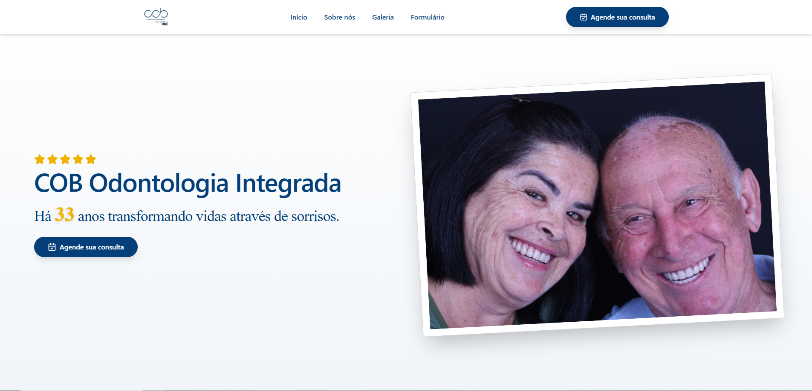
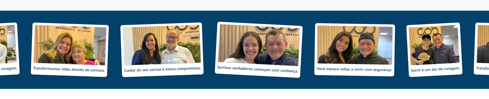
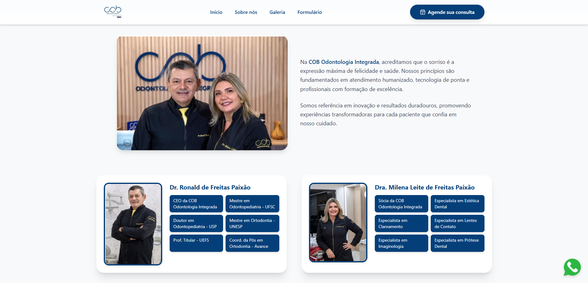
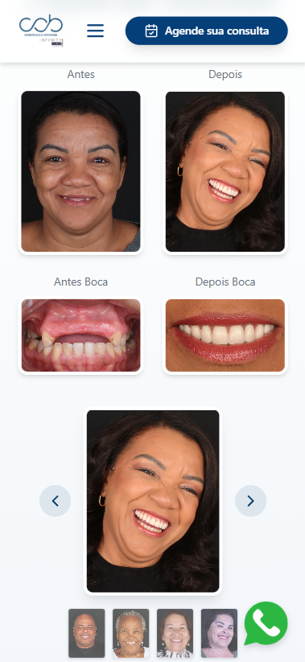

# 🚀 Landing Page - COB Odontologia Integrada

Este projeto é uma nova landing page desenvolvida para a **COB Odontologia Integrada**, com o objetivo de modernizar a presença digital da empresa, oferecendo uma experiência visualmente agradável, responsiva e alinhada às melhores práticas de UI/UX.

## 📌 Objetivo

Substituir a landing page atual criada pela equipe de marketing por uma nova versão mais moderna e performática, que aproveita os recursos do React e Tailwind CSS para criar um site leve, responsivo e com navegação fluida.

## ✨ Destaques da Solução

- ✔️ Design responsivo adaptado para dispositivos móveis e desktop
- 🎯 Foco em conversão e apresentação de serviços
- ⚡ Animações suaves com **Framer Motion**
- 🔍 Navegação fluida com **React Scroll**
- 🎨 Ícones profissionais com **Lucide React**

## 🛠️ Tecnologias Utilizadas

- [React](https://react.dev/)
- [Tailwind CSS](https://tailwindcss.com/)
- [Vite](https://vitejs.dev/)
- [Framer Motion](https://www.framer.com/motion/)
- [Lucide React](https://lucide.dev/)
- [React Scroll](https://www.npmjs.com/package/react-scroll)

## 📦 Como executar localmente

Clone o repositório e instale as dependências:

```bash
git clone https://github.com/Drimzart/cobodontologiaintegrada.git
cd cob-odontologia-integrada
npm install
npm run dev
```

## 🌐 Link de acesso

O projeto será publicado em produção após a homologação final pela equipe.

🚧 Link em breve: [[https://cob-odontologia.vercel.app](https://cobodontologiaintegrada.vercel.app/)]

---

## 📷 Screenshots

Abaixo estão algumas capturas de tela da aplicação **COB Odontologia Integrada**, ilustrando a experiência tanto no desktop quanto no mobile.

---

### 🏠 Página Inicial – `homepage.png`



A tela inicial apresenta a identidade visual da clínica e uma navegação clara para os principais serviços. Conta com animações suaves e estrutura otimizada para destacar os diferenciais da empresa.

---

### 🧺 Seção "Varal de Benefícios" – `varal.png`



Essa seção traz um "varal visual" com os principais benefícios oferecidos, como agilidade no atendimento, plano acessível e suporte humanizado. Um componente visual que ajuda a reforçar o valor da proposta.

---

### 🧑‍⚕️ Seção "Sobre a COB" – `sobre.png`



Apresentação institucional da clínica, destacando seus princípios, estrutura e atuação no mercado odontológico. Foco na confiança e transparência com o paciente.

---

### 📱 Galeria de Casos (Versão Mobile) – `galeriamobile.png`



Demonstração da responsividade da interface. A galeria de casos de sucesso foi cuidadosamente adaptada para garantir uma navegação fluida e envolvente no mobile.

---


---

## 🙋‍♂️ Desenvolvido por

[Kaio Murillo](https://linkedin.com/in/kaio-murillo)  
[GitHub](https://github.com/Drimzart)
